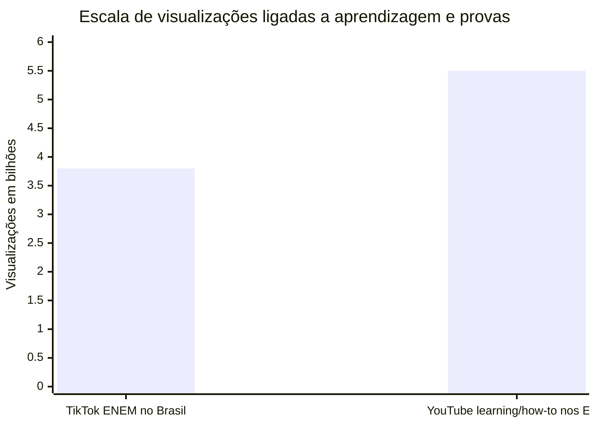
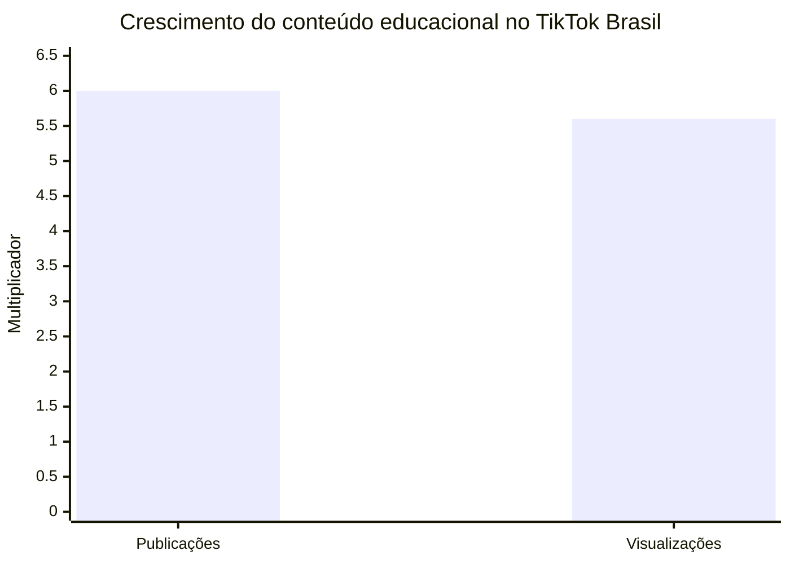
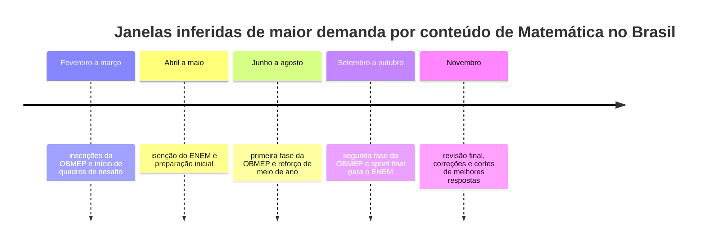

# Tendências de dois mil e vinte e seis para vídeos de Matemática em YouTube, TikTok e Google Trends

## Resumo executivo

Os sinais oficiais mais fortes para conteúdo de Matemática em dois mil e vinte e seis apontam para uma estratégia multiformato, não para uma aposta única em vídeo curto ou vídeo longo. No YouTube, a própria plataforma diz que o consumo já acontece em “todos os formatos e em todas as telas”, com Shorts, long-form, lives e cursos convivendo no mesmo ecossistema; os Shorts passam de duzentos bilhões de visualizações diárias, e o YouTube segue líder em tempo de streaming nos EUA segundo a Nielsen. No campo de aprendizagem, o blog oficial do YouTube reportou mais de cinco bilhões e meio de visualizações em conteúdos de learning e how-to nos EUA em um único mês, além de recursos como Ask, quizzes, Courses e recortes automáticos de lives para Shorts. citeturn25view3turn21view0turn26view3turn9view2

No TikTok, o cenário brasileiro é ainda mais favorável para educação. Em pesquisa oficial da plataforma com mais de noventa e um mil usuários brasileiros adultos, quarenta e um vírgula cinco por cento disseram usar vídeos do app para se preparar para vestibulares, concursos ou avaliações; noventa e quatro por cento afirmaram melhora no desempenho, e o TikTok informou crescimento de seis vezes nas publicações educacionais e de cinco vírgula seis vezes nas visualizações no Brasil entre dois mil e vinte e quatro e dois mil e vinte e cinco. No mesmo pacote, a plataforma informou que conteúdo relacionado ao ENEM somou três bilhões e oitocentas milhões de visualizações entre janeiro e outubro do ano anterior, enquanto o feed STEM já reúne dez milhões de conteúdos globalmente desde dois mil e vinte e três. citeturn23view0turn23view2

Para Matemática, isso empurra o criador para cinco frentes de maior potencial: conteúdo útil do cotidiano, revisão para provas, puzzles de raciocínio, visualizações/estatística e formatos participativos baseados em comentários, enquetes e lives. Essa leitura também conversa com o calendário oficial brasileiro de dois mil e vinte e seis: o Inep já abriu a etapa de isenção do Enem e a OBMEP está com cronograma ativo de fevereiro a outubro; além disso, o Banco Central informou expectativas de inflação de quatro vírgula um por cento para dois mil e vinte e seis, acima da meta de três por cento, o que torna matemática financeira especialmente oportuna. citeturn37view2turn37view3turn37view1turn40search1turn40search3

A implicação editorial mais importante é esta: o canal de Matemática mais promissor em dois mil e vinte e seis é aquele que opera como sistema. Em termos práticos, isso significa usar Short ou TikTok para descoberta e gancho, vídeo médio para explicação e prova de valor, e live para comunidade e resolução ao vivo, reaproveitando depois os melhores momentos como novos Shorts. Isso é uma inferência editorial construída a partir dos sinais oficiais de YouTube, TikTok e Google Trends, não um “dado único” de uma plataforma só. citeturn33view3turn9view2turn35view0turn17view0

## Como esta pesquisa foi construída

Eu priorizei fontes oficiais e recentes, com preferência por materiais em português do Brasil quando estavam disponíveis. Isso foi plenamente possível em TikTok, Google Trends, Inep, OBMEP e Banco Central; para YouTube, os materiais mais úteis e recentes encontrados para dois mil e vinte e seis vieram do blog oficial global em inglês, então sempre que usei números dessa plataforma eu os tratei explicitamente como dados internacionais. citeturn11view1turn17view0turn23view0turn23view2turn37view2turn37view3turn37view1turn9view0turn9view1

No caso do Google Trends, a documentação oficial é clara: a ferramenta trabalha com uma amostra aleatória de buscas agregadas, anonimizadas e categorizadas do Google e do YouTube; ela oferece as áreas Explorar e Em alta, permite exportação em CSV e RSS e atualiza tendências recentes aproximadamente a cada dez minutos, em mais de cem países e regiões. Também há filtro por categoria, inclusive “Empregos e educação”, o que é especialmente útil para nichos educacionais. citeturn17view0turn17view1turn31view0

Ao mesmo tempo, a interface pública do Google Trends não devolveu séries comparáveis por termo neste ambiente de navegação, exibindo mensagem de incompatibilidade na aba Explore. Por isso, para não inventar precisão, eu não atribuí índices numéricos do Trends a consultas matemáticas específicas como “porcentagem”, “OBMEP” ou “probabilidade”; a camada Google Trends deste relatório é, portanto, metodológica e qualitativa, apoiada na documentação oficial, nas listas públicas do Year in Search e em inferências editoriais transparentes. citeturn30view0turn17view0turn15view0

Quando eu falo em “tendência inferida” neste relatório, quero dizer exatamente isso: um cruzamento entre sinais oficiais de plataforma, calendário educacional e contexto brasileiro. Esse é o caso, por exemplo, da janela sazonal de interesse para ENEM e OBMEP, ou da oportunidade maior para matemática financeira num contexto de inflação acima da meta e Selic ainda relevante para crédito e financiamento. citeturn37view2turn37view3turn37view1turn40search3

## O que as plataformas estão sinalizando

**YouTube.** O YouTube reforça que o melhor jogo em dois mil e vinte e seis é combinar formatos. A carta do CEO para dois mil e vinte e seis destaca que a audiência escolhe YouTube para long-form, Shorts, lives e podcasts; o produto de learning foi reforçado com Ask, quizzes e Courses; e o produto de live ganhou simultaneidade em horizontal e vertical, além de highlights automáticos em Shorts. Somado a isso, a própria orientação oficial de Shorts enfatiza gancho nos primeiros segundos, títulos claros, formato vertical e ideias como tutoriais, desafios e bastidores. Em linguagem de criador: Matemática não precisa escolher entre aula curta ou aula profunda; pode operar em funil. citeturn25view3turn26view3turn9view2turn33view3turn33view1

**TikTok.** O TikTok traz o sinal mais forte para pt-BR. O relatório TikTok Next dois mil e vinte e seis, inclusive em português, organiza a cultura do ano em três vetores: mais realidade e menos polimento; mais curiosidade guiada por busca, comentários e nichos adjacentes; e mais “ROI emocional”, isto é, conteúdo que justifica claramente por que vale a pena prestar atenção ou agir. No Brasil, isso não fica só no discurso: a plataforma reporta uso massivo para estudo, salto de conteúdo educacional, bilhões de views em ENEM e um ambiente STEM em crescimento. Para Matemática, isso favorece vídeos práticos, honestos, visuais, com payoff claro e espaço para participação da comunidade. citeturn11view1turn13view0turn35view1turn35view0turn36view0turn23view0turn23view2

**Google Trends.** O papel do Google Trends aqui é menos o de “ranking pronto de termos matemáticos” e mais o de bússola editorial. A documentação oficial mostra que o Trends serve para entender consultas, tópicos relacionados, interesse regional e tendências recentes no Google e no YouTube; a página Em alta traz volume aproximado de busca, horário de início, gráfico temporal e exportação. Além disso, o Year in Search do Brasil em dois mil e vinte e cinco deu grande visibilidade a consultas em formato de pergunta, especialmente a lista “O que é...”, reforçando, como inferência editorial, a força de títulos explicativos e conceituais para vídeos-base de Matemática. citeturn17view0turn17view1turn15view0

**Síntese editorial.** Cruzando as três plataformas, os temas mais fortes para Matemática em dois mil e vinte e seis não são os mais abstratos por definição, e sim os que conseguem entregar pelo menos um destes cinco valores: utilidade imediata, leitura de mundo, preparação para prova, surpresa intelectual ou participação da comunidade. Em outras palavras, “como isso funciona?”, “onde isso aparece na vida real?”, “como isso cai na prova?” e “você acerta antes da resposta?” parecem ser molduras melhores do que “aula completa sobre tema X”. Essa é uma inferência construída a partir dos sinais oficiais acima. citeturn35view1turn35view0turn25view3turn33view3turn17view0

Os gráficos abaixo usam apenas números publicados oficialmente pelas plataformas. Como os recortes não são idênticos entre si, a leitura correta é de ordem de grandeza e prioridade editorial, não de benchmark único. citeturn23view2turn26view3turn25view3

No gráfico acima, o valor do TikTok se refere ao Brasil e ao recorte de janeiro a outubro do ano anterior; o do YouTube é internacional e se refere aos EUA em junho de dois mil e vinte e cinco. Ainda assim, ambos mostram claramente que educação e preparação para provas já operam em escala de bilhões. citeturn23view2turn26view3

Esse segundo gráfico é o sinal mais forte e diretamente brasileiro deste relatório: no TikTok, o conteúdo educacional acelerou ao mesmo tempo em quantidade publicada e em consumo. Para criadores de Matemática, isso reduz o risco de apostar em linguagem didática e acessível. citeturn23view2

A timeline abaixo é **inferida**, não um gráfico bruto de Google Trends. Ela combina o calendário oficial de ENEM e OBMEP com o padrão de descoberta e estudo visto nas plataformas. citeturn37view2turn37view3turn23view0turn23view2

## Oito sugestões de vídeos

**Um) Porcentagem sem decoréba: o truque visual que resolve desconto, aumento e cashback**

**Formato sugerido.** Short vertical de quarenta e cinco a noventa segundos, com edição rápida e quadro recorrente.

**Descrição.** Em vez de ensinar porcentagem por fórmula logo de cara, o vídeo parte de uma barra visual simples e mostra que “porcentagem” é só uma maneira de enxergar partes do todo. Cada episódio resolve um caso real diferente — desconto, reajuste, cashback, comissão ou aumento de preço — para aumentar compartilhamento e utilidade. A ideia é que o público sinta: “isso me ajuda hoje”.  

**Palavras-chave.** porcentagem, desconto, aumento percentual, cashback, regra de três, matemática financeira, aula curta, shorts matemática, conta rápida, compras, educação financeira, matemática prática

**Por que está alinhado com as tendências.** É a interseção mais clara entre microaprendizagem, utilidade e retenção. O TikTok Brasil mostra forte uso do app para estudar, o TikTok Next dois mil e vinte e seis aponta preferência por conteúdo mais útil e grounded, e o YouTube recomenda Shorts com gancho forte nos primeiros segundos, títulos claros e formatos como tutoriais e desafios. citeturn23view0turn35view1turn33view3

**Miniatura sugerida.** Fundo limpo, uma etiqueta “-30%” gigante, seta para cima com “+12%” e a pergunta “voltou ao preço?”.

**Roteiro-base.**
- Abrir com uma pergunta que quase todo mundo erra.
- Mostrar a barra visual do preço original.
- Resolver em três movimentos na tela, sem excesso de conta.
- Fechar com um mini-desafio e CTA para o próximo tema.

**Dois) A fatura que nunca acaba: a matemática brutal do cartão de crédito**

**Formato sugerido.** Vídeo explicativo de cinco a oito minutos, com corte adicional de até um minuto para Short.

**Descrição.** O vídeo começa com uma pequena história: alguém paga o mínimo da fatura e acredita que “comprou tempo”. A partir daí, você mostra como juros, rotativo, parcelamento e custo total entram em cascata, transformando uma decisão pequena em um problema grande. O fechamento ideal é prático: três regras simples para não cair na armadilha.  

**Palavras-chave.** juros compostos, cartão de crédito, fatura, rotativo, parcelas, Selic, inflação, orçamento, dívida, matemática do dia a dia, educação financeira, explicação simples

**Por que está alinhado com as tendências.** Esse tema junta “realidade”, prova de valor e contexto brasileiro. O TikTok Next dois mil e vinte e seis destaca comparação, demonstração e how-to como formatos fortes para reduzir dúvida, enquanto o Banco Central informa inflação esperada acima da meta em dois mil e vinte e seis e lembra que a Selic influencia empréstimos, financiamentos e outras taxas da economia. citeturn36view0turn37view1turn40search1turn40search3

**Miniatura sugerida.** Um cartão em primeiro plano, uma fatura subindo como escada e a chamada “R$ 500 viram quanto?”.

**Roteiro-base.**
- Começar com o caso de uma fatura aparentemente “pequena”.
- Mostrar a bola de neve mês a mês em gráfico simples.
- Explicar os conceitos sem jargão excessivo.
- Fechar com uma decisão prática que o público pode tomar hoje.

**Três) Você não é ruim em probabilidade: seu cérebro que cai nessas armadilhas**

**Formato sugerido.** Vídeo de três a seis minutos, estilo desafio-explicação, com ritmo rápido.

**Descrição.** Use situações comuns — loteria, moeda, sorteio, sequência de vitórias, escolha entre duas caixas — para mostrar onde a intuição costuma falhar. O vídeo tem cara de desafio, mas termina com fundamento matemático real e aplicável. É excelente para retenção porque o público quer confirmar se estava certo.  

**Palavras-chave.** probabilidade, loteria, chance, viés cognitivo, estatística, pegadinha matemática, paradoxo, raciocínio lógico, desafio, curiosidade, matemática fácil, explicação

**Por que está alinhado com as tendências.** “Curiosity Detours” é praticamente a moldura perfeita para esse tipo de conteúdo: o TikTok diz que em dois mil e vinte e seis a curiosidade vira moeda, com exploração pela busca, pela barra de comentários e por caminhos inesperados. No YouTube, os sinais oficiais de mini-séries, ganchos rápidos e comunidade favorecem quadros em que a audiência tenta acertar antes da revelação. citeturn35view0turn33view1

**Miniatura sugerida.** Duas opções lado a lado, uma moeda e a frase “qual tem mais chance?”.

**Roteiro-base.**
- Apresentar o dilema sem explicar nada.
- Dar três segundos para o público escolher.
- Revelar o erro intuitivo mais comum.
- Explicar a lógica correta com um desenho muito simples.

**Quatro) Gráficos que mentem: como a estatística engana seus olhos**

**Formato sugerido.** Vídeo explicativo de quatro a sete minutos, com muitos elementos visuais e quiz na tela.

**Descrição.** Mostre dois gráficos quase iguais, mas com eixos cortados, escalas diferentes ou bases alteradas, e peça ao público que diga qual parece mais convincente. Em seguida, revele por que média, mediana, eixo truncado e porcentagem fora de base podem distorcer a leitura. É um vídeo que serve para escola, trabalho e consumo de notícias.  

**Palavras-chave.** gráficos, estatística, média, mediana, eixo truncado, porcentagem, fake news, leitura de dados, pesquisa, visualização, matemática aplicada, interpretação

**Por que está alinhado com as tendências.** O TikTok Next fala em “evidence economy” e recomenda comparações, demos e how-tos como formato central para reduzir incerteza; no YouTube, quizzes e aprendizagem ativa tornam esse tema ainda mais forte, porque o público pode responder antes da correção. Em termos de busca, o enquadramento “como entender” ou “como não cair” também conversa bem com a lógica do Google Trends e com o padrão de consultas explicativas visto nas listas públicas do Google. citeturn36view0turn26view1turn17view0turn15view0

**Miniatura sugerida.** Duas barras quase idênticas, uma “explodida” por eixo cortado, com a frase “qual está mentindo?”.

**Roteiro-base.**
- Abrir com dois gráficos contraditórios.
- Pedir uma leitura rápida do público.
- Explicar onde está a manipulação visual.
- Fechar com um checklist de quatro segundos para checar qualquer gráfico.

**Cinco) ENEM em modo turbo: cinco padrões de questão de Matemática que mais derrubam**

**Formato sugerido.** Mini-série de episódios curtos de dois a quatro minutos ou compilado de oito a doze minutos.

**Descrição.** Cada episódio ataca um padrão recorrente: leitura do enunciado, interpretação de gráfico, unidade de medida, razão, porcentagem ou geometria simples. O foco não é resolver cinquenta exercícios, e sim nomear o tipo de erro e mostrar como evitar a queda. Isso deixa o vídeo mais “salvável” e mais reaproveitável em playlist.  

**Palavras-chave.** ENEM, ENEM dois mil e vinte e seis, matemática ENEM, revisão, questões comentadas, prova, gráficos, funções, geometria, estratégia de prova, vestibular, estudo rápido

**Por que está alinhado com as tendências.** Esse é o caso mais claro de demanda brasileira em escala: o TikTok informou três bilhões e oitocentas milhões de visualizações em conteúdos relacionados ao ENEM no recorte divulgado, e mais de quarenta por cento dos respondentes brasileiros disseram usar o app para estudar. No YouTube, mini-séries, Courses, quizzes e Shorts conectados a vídeos maiores combinam perfeitamente com uma franquia de revisão rápida e recorrente. citeturn23view2turn23view0turn33view1turn26view0turn33view3

**Miniatura sugerida.** Caderno de prova estilizado, erro destacado em vermelho e a chamada “aqui muita gente cai”.

**Roteiro-base.**
- Abrir com o “erro invisível” do padrão da vez.
- Mostrar uma questão-modelo enxuta.
- Resolver com três passos e um alerta final.
- Encerrar com mini-quiz e chamada para o próximo episódio.

**Seis) O problema da OBMEP que parece impossível até a ideia certa aparecer**

**Formato sugerido.** Vídeo de seis a dez minutos em estilo storytelling-desafio, com teaser curto para Shorts.

**Descrição.** Em vez de despejar a solução, trate o problema como um pequeno suspense matemático. Mostre tentativas naturais, um beco sem saída e, então, a “sacada” que muda tudo. Isso transforma um conteúdo avançado em experiência narrativa — e não apenas em exposição técnica.  

**Palavras-chave.** OBMEP, olimpíada de matemática, desafio matemático, raciocínio lógico, problema comentado, solução elegante, estratégia, padrões, prova de matemática, matemática olímpica, criatividade, resolução

**Por que está alinhado com as tendências.** A OBMEP já tem calendário oficial ativo em dois mil e vinte e seis, com marcos distribuídos de fevereiro a outubro, o que cria uma janela real para conteúdos de desafio. Além disso, a lógica de curiosidade guiada, descoberta e mini-séries recomendada por TikTok e YouTube favorece exatamente vídeos em que a solução demora um pouco para “virar a chave” na cabeça do espectador. citeturn37view3turn35view0turn33view1

**Miniatura sugerida.** Um enunciado curto desfocado, a palavra “impossível?” e um traço elegante apontando para a solução.

**Roteiro-base.**
- Lançar o desafio e dar alguns segundos de pausa.
- Mostrar a tentativa que quase todo mundo faria.
- Introduzir a pista decisiva.
- Fechar com a solução elegante e convite para métodos alternativos.

**Sete) A cidade é uma aula de geometria: encontre triângulos, áreas e sombras na rua**

**Formato sugerido.** Vídeo de seis a dez minutos, com linguagem de passeio e overlays geométricos; recortes verticais opcionais.

**Descrição.** Leve o celular para a rua e prove que geometria aparece em fachadas, escadas, quadras, postes e sombras. O vídeo mistura observação, desenho sobre imagem e conta rápida, dando sensação de descoberta real. Ele também ajuda a quebrar a associação de Matemática com quadro branco fechado.  

**Palavras-chave.** geometria, semelhança de triângulos, áreas, ângulos, cidade, arquitetura, sombras, visualização, matemática na vida real, STEM, storytelling, educação

**Por que está alinhado com as tendências.** Esse formato casa com o movimento de conteúdo mais real, processual e menos polido que o TikTok descreve para dois mil e vinte e seis, incluindo a valorização de bastidores e processo visível. Também conversa com o crescimento da divulgação STEM na plataforma e com o entendimento do YouTube de que o mesmo tema pode viver bem tanto em cortes curtos quanto em vídeos mais completos. citeturn35view1turn23view2turn25view3

**Miniatura sugerida.** Você apontando para um prédio com linhas triangulares sobrepostas e a frase “isso é geometria”.

**Roteiro-base.**
- Começar mostrando uma cena urbana “normal”.
- Desenhar formas geométricas por cima da imagem.
- Resolver uma medida ou proporção simples ao vivo.
- Fechar pedindo que a audiência envie exemplos do bairro deles.

**Oito) Plantão da Matemática ao vivo: o chat escolhe a próxima questão**

**Formato sugerido.** Live semanal de quarenta e cinco a noventa minutos, com cortes posteriores de trinta a sessenta segundos.

**Descrição.** A estrutura é simples e forte: a audiência vota entre três questões, você resolve uma, abre espaço para dúvidas, e o chat define a próxima. O valor aqui não está só na resolução, mas na sensação de presença, ritmo e coautoria. Depois, os melhores momentos viram Shorts, reforçando descoberta e recorrência.  

**Palavras-chave.** live matemática, dúvidas ao vivo, resolução de questões, ENEM, OBMEP, chat, enquete, comunidade, revisão, estudo, perguntas e respostas, shorts highlights

**Por que está alinhado com as tendências.** O YouTube informou que mais de trinta por cento dos usuários logados assistiram a conteúdo ao vivo em um trimestre recente e está ampliando recursos de descoberta, transmissão simultânea vertical e horizontal e highlights automáticos em Shorts. Somando isso à cultura de comentários, participação e busca por comunidade descrita pelo TikTok, live vira uma peça central e não apenas acessória para canais de Matemática. citeturn9view2turn35view0turn35view1

**Miniatura sugerida.** Selo de “AO VIVO”, três opções de questão em caixas e texto “o chat decide”.

**Roteiro-base.**
- Abrir com enquete de três questões.
- Resolver com pausas planejadas para o chat.
- Destacar erros comuns e responder perguntas curtas.
- Encerrar já apontando quais trechos virarão Shorts.

## Tabela comparativa

| Título | Formato sugerido | Público-alvo | Nível de dificuldade | Motivo da tendência |
|---|---|---|---|---|
| Porcentagem sem decoréba: o truque visual que resolve desconto, aumento e cashback | 45–90 s, vertical, tutorial visual recorrente | Ensino fundamental final, ensino médio e público geral | Básico | Microaprendizagem útil, altíssima compatibilidade com Shorts e TikTok |
| A fatura que nunca acaba: a matemática brutal do cartão de crédito | 5–8 min, explainer com storytelling | Jovens adultos, famílias, iniciantes em finanças | Básico a intermediário | Conteúdo real, payoff imediato, matemática financeira em contexto brasileiro |
| Você não é ruim em probabilidade: seu cérebro que cai nessas armadilhas | 3–6 min, desafio + explicação | Ensino médio, vestibulandos, público curioso | Intermediário | Curiosidade, debate, comentários e forte potencial de série |
| Gráficos que mentem: como a estatística engana seus olhos | 4–7 min, visualização + quiz | Alunos, professores, público de atualidades | Básico a intermediário | Leitura de mundo, shareability e aprendizagem ativa |
| ENEM em modo turbo: cinco padrões de questão de Matemática que mais derrubam | Série de 2–4 min ou compilado de 8–12 min | Vestibulandos e cursinhos | Intermediário | Escala massiva de interesse em ENEM e ótimo encaixe em mini-séries |
| O problema da OBMEP que parece impossível até a ideia certa aparecer | 6–10 min, storytelling-desafio | Entusiastas, olimpíadas, alunos fortes | Avançado | Calendário oficial ativo e alta retenção por suspense intelectual |
| A cidade é uma aula de geometria: encontre triângulos, áreas e sombras na rua | 6–10 min, passeio visual com overlays | Teens, professores, curiosos de STEM | Intermediário | Conteúdo real, bastidor, visual forte e STEM acessível |
| Plantão da Matemática ao vivo: o chat escolhe a próxima questão | Live de 45–90 min + cortes curtos | Comunidade recorrente, ENEM, OBMEP | Misto | Interatividade, fidelização e reaproveitamento em Shorts |

Os motivos resumidos na tabela condensam os sinais oficiais discutidos no relatório: multiformato e interatividade no YouTube, autenticidade/curiosidade/valor claro no TikTok, lógica de buscas explicativas no Google Trends e janelas sazonais reais de ENEM, OBMEP e matemática financeira no Brasil. citeturn25view3turn26view3turn9view2turn35view1turn35view0turn36view0turn17view0turn15view0turn37view2turn37view3turn37view1

Se eu traduzisse toda a pesquisa em uma frase editorial, seria esta: **em dois mil e vinte e seis, Matemática cresce melhor quando parece menos “matéria isolada” e mais ferramenta para entender, decidir, competir, economizar e participar junto**. Essa conclusão é inferida a partir das fontes oficiais usadas aqui. citeturn23view0turn23view2turn25view3turn35view1turn17view0
